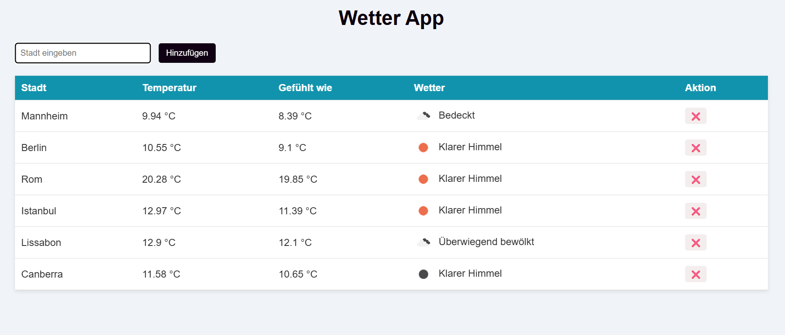

## Wetter App – Projektdokumentation
## Ziel des Projekts

Dieses Projekt zeigt das aktuelle Wetter für eine Stadt an.

Der Benutzer gibt eine Stadt ein und bekommt:

Temperatur
gefühlte Temperatur
Beschreibung des Wetters
ein passendes Icon
## Funktionen
- Städte eingeben
- Wetter anzeigen
- Städte wieder löschen
- Daten bleiben gespeichert (LocalStorage)
## Beispiel

Browser

## Dateien
index.html – Aufbau der Seite
style.css – Design
app.js – Funktion (Logik)

## Wie funktioniert das?
Benutzer gibt eine Stadt ein
Die App fragt Daten von der OpenWeatherMap API ab
Die Daten werden in einer Tabelle angezeigt
Für jede Stadt wird eine neue Zeile erstellt
Die Städte werden gespeichert

## Benutzeranleitung
Öffne index.html im Browser
Gib eine Stadt ein
Drücke „Hinzufügen“ oder Enter
Das Wetter wird angezeigt

## Technik
HTML
CSS
JavaScript
OpenWeatherMap API
